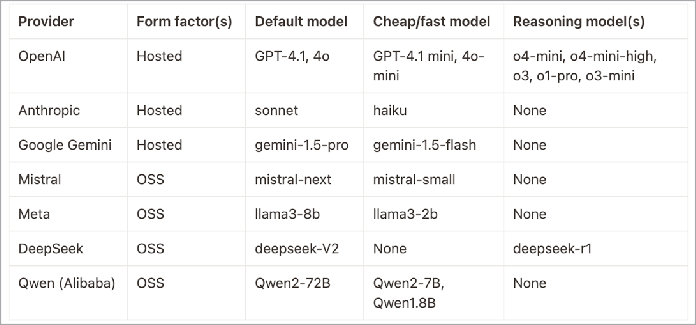
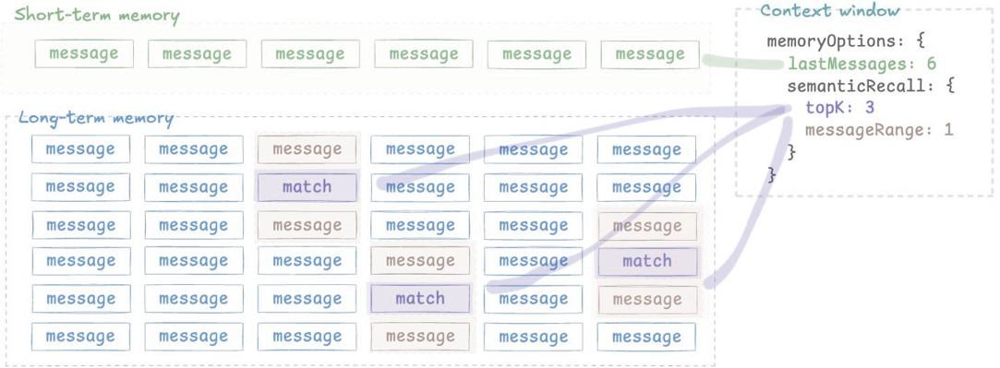

# Prinsip Membangun Agen AI Edisi Kedua

_Versi terbaru_

## Kata Pengantar

SAM BHAGWAT

Edisi ke-2

Dua bulan adalah waktu yang singkat untuk menulis edisi baru sebuah buku, tetapi kehidupan bergerak cepat di dunia AI.

Edisi ini memiliki konten baru tentang MCP, pembuatan gambar, suara, A2A, penjelajahan web dan penggunaan komputer, streaming workflow, pembuatan kode, RAG agentik, dan deployment.

Rekayasa AI terus semakin panas. Download mingguan Mastra telah berlipat ganda setiap dua bulan terakhir. Di pertemuan malam AI khas San Francisco, saya membagikan ratusan kopi buku ini.

Kemudian dua hari yang lalu, sebuah newsletter developer populer men-tweet tentang buku ini dan 3.500 orang (!) mendownload kopi digital (tersedia gratis di mastra.ai/book jika Anda membaca kopi fisik).

Jadi ya, 2025 benar-benar tahunnya agen. Terima kasih telah membaca, dan selamat membangun!

Sam Bhagwat
San Francisco, CA
Mei 2025

## Pendahuluan

Kami telah menyusun buku ini menjadi beberapa bagian berbeda.

**Prompting Large Language Model (LLM)** memberikan latar belakang tentang apa itu LLM, cara memilihnya, dan cara berkomunikasi dengannya.

**Membangun Agen** memperkenalkan blok bangunan kunci pengembangan AI. Agen adalah lapisan di atas LLM: mereka dapat mengeksekusi kode, menyimpan dan mengakses memori, serta berkomunikasi dengan agen lain. Chatbot biasanya didukung oleh agen.

**Workflow Berbasis Graph** telah muncul sebagai teknik yang berguna untuk membangun dengan LLM ketika agen tidak memberikan output yang cukup terprediksi.

**Retrieval-Augmented Generation (RAG)** mencakup pola umum pencarian berbasis LLM. RAG membantu Anda mencari melalui korpus besar informasi (biasanya milik perusahaan) untuk mengirimkan bagian-bagian relevan ke panggilan LLM tertentu.

**Sistem Multi-agen** mencakup aspek koordinasi dalam membawa agen ke produksi. Masalahnya sering melibatkan banyak desain organisasi!

**Pengujian dengan Evaluasi** penting dalam memeriksa apakah aplikasi Anda memberikan kualitas yang cukup kepada pengguna.

**Pengembangan lokal dan deployment serverless** adalah dua tempat di mana kode Anda perlu bekerja. Anda harus dapat beriterasi dengan cepat di mesin Anda, lalu membuat kode hidup di Internet.

Perhatikan bahwa kami tidak membahas topik machine learning (ML) tradisional seperti reinforcement learning, pelatihan model, dan fine-tuning.

Hari ini sebagian besar aplikasi AI hanya perlu _menggunakan_ LLM, bukan membangunnya.

---

## BAGIAN I: PROMPTING LARGE LANGUAGE MODEL (LLM)

### Sejarah Singkat LLM

AI telah menjadi teknologi yang selalu "di cakrawala" selama lebih dari empat puluh tahun.

Ada kemajuan penting selama tahun 2000-an dan 2010-an: mesin catur, pengenalan suara, mobil self-driving.

Sebagian besar kemajuan pada "AI generatif" datang sejak 2017, ketika delapan peneliti dari Google menulis makalah berjudul "Attention is All You Need".

Makalah tersebut menggambarkan arsitektur untuk menghasilkan teks di mana "large language model" (LLM) diberi sekumpulan "token" (kata dan tanda baca) dan difokuskan untuk memprediksi "token" berikutnya.

Langkah besar berikutnya terjadi pada November 2022. Antarmuka chat bernama ChatGPT, diproduksi oleh startup yang didanai dengan baik bernama OpenAI, menjadi viral dalam semalam.

Hari ini, ada beberapa penyedia LLM berbeda, yang menyediakan antarmuka chat konsumen dan API developer:

- **OpenAI.** Didirikan tahun 2015 oleh delapan orang termasuk peneliti AI Ilya Sutskever, software engineer Greg Brockman, Sam Altman (kepala YC), dan Elon Musk.
- **Anthropic (Claude).** Didirikan tahun 2020 oleh Dario Amodei dan sekelompok mantan peneliti OpenAI. Menghasilkan model populer untuk penulisan kode, serta tugas berbasis API.
- **Google (Gemini).** LLM inti diproduksi oleh tim DeepMind yang diakuisisi Google pada 2014.
- **Meta (Llama).** Perusahaan induk Facebook memproduksi kelas model open-source Llama. Dianggap sebagai grup AI open-source terkemuka di AS.
- **Lainnya** termasuk Mistral (perusahaan open-source Prancis), DeepSeek (perusahaan open-source Tiongkok).

### Memilih Penyedia dan Model

Salah satu pilihan pertama yang perlu Anda buat saat membangun aplikasi AI adalah model mana yang akan digunakan. Berikut beberapa pertimbangan:

#### Hosted vs open-source

Saran pertama yang biasanya kami berikan kepada orang-orang ketika membangun aplikasi AI adalah memulai dengan penyedia hosted seperti OpenAI, Anthropic, atau Google Gemini.

Bahkan jika Anda berpikir akan perlu menggunakan open-source, buat prototipe dengan API cloud, atau Anda akan mendebug masalah infrastruktur alih-alih benar-benar mengiterasi kode Anda. Salah satu cara untuk melakukan ini tanpa menulis ulang banyak kode adalah dengan menggunakan library perutean model (lebih lanjut nanti).

#### Ukuran model: akurasi vs biaya/latensi

Large language model bekerja dengan mengalikan array dan matriks angka bersama-sama. Setiap penyedia memiliki model yang lebih besar, yang lebih mahal, akurat, dan lambat, serta model yang lebih kecil, yang lebih cepat, murah, dan kurang akurat.

Kami biasanya merekomendasikan orang untuk memulai dengan model yang lebih mahal saat membuat prototipe — setelah Anda mendapatkan sesuatu yang bekerja, Anda dapat menyesuaikan biaya.

#### Ukuran jendela konteks

Satu variabel yang mungkin ingin Anda pertimbangkan adalah "jendela konteks" model Anda. Berapa banyak token yang dapat diterimanya? Terkadang, terutama untuk prototipe awal, Anda mungkin ingin memberi banyak konteks ke model untuk menghemat usaha memilih konteks yang relevan.

Saat ini, jendela konteks terpanjang dimiliki oleh set model Google Gemini Flash; Gemini Flash 1.5 Pro mendukung jendela konteks 2 juta token (sekitar 4.000 halaman teks).

Ini memungkinkan beberapa aplikasi yang menarik; Anda bisa bayangkan asisten dukungan dengan seluruh basis kode dalam jendela konteksnya.

#### Model reasoning

Jenis model lain adalah yang disebut "model reasoning", yaitu model yang melakukan banyak logika internal sebelum mengembalikan respons. Mungkin butuh beberapa detik, atau menit, untuk memberikan respons, dan akan mengembalikan respons sekaligus (sambil streaming beberapa "langkah berpikir" di sepanjang jalan).

Model reasoning semakin baik dan mereka melakukannya dengan cepat. Sekarang, mereka mampu memecah masalah rumit dan benar-benar "berpikir" melalui mereka langkah demi langkah, hampir seperti manusia.

Apa yang berubah? Teknik baru seperti chain-of-thought prompting memungkinkan model ini menunjukkan pekerjaan mereka, langkah demi langkah. Lebih baik lagi, metode yang lebih baru seperti "chain of draft" dan "chain of preference optimization" membantu mereka tetap fokus. Alih-alih menulis setiap detail kecil atau mengulangi diri sendiri — mereka langsung ke intinya, hanya berbagi langkah paling penting dan melewatkan yang tidak penting. Ini berarti Anda mendapatkan reasoning yang jelas dan efisien, bukan dinding teks.

Intinya: jika Anda memberi model ini cukup konteks dan contoh yang baik, mereka dapat memberikan jawaban mengejutkan dan berkualitas tinggi untuk pertanyaan sulit. Misalnya, jika Anda ingin model membantu mendiagnosis kasus medis yang rumit, memberikannya riwayat pasien, gejala, dan beberapa contoh kasus akan menghasilkan hasil yang jauh lebih baik daripada sekadar mengajukan pertanyaan samar. Triknya tetap sama: semakin banyak Anda membantu mereka di awal, semakin baik reasoning mereka.

Anda harus menganggap model reasoning sebagai "generator laporan" — Anda perlu memberi mereka banyak konteks di awal melalui many-shot prompting (lebih lanjut nanti). Jika Anda melakukannya, mereka dapat mengembalikan respons berkualitas tinggi. Jika tidak, mereka akan keluar jalur.

#### Penyedia dan model (Mei 2025)



### Menulis Prompt yang Bagus

Salah satu keterampilan dasar dalam rekayasa AI adalah menulis prompt yang baik.

LLM akan mengikuti instruksi, jika Anda tahu cara menentukannya dengan baik. Berikut beberapa tips dan teknik yang akan membantu:

#### Beri LLM lebih banyak contoh

Ada tiga teknik dasar prompting.

- **Zero-shot**: Pendekatan "YOLO". Ajukan pertanyaan dan berharap yang terbaik.
- **Single-shot**: Ajukan pertanyaan, lalu berikan satu contoh (dengan input + output) untuk memandu model.
- **Few-shot**: Berikan beberapa contoh untuk kontrol lebih presisi atas output.

Semakin banyak contoh = semakin banyak panduan, tetapi juga membutuhkan lebih banyak waktu.

#### Pendekatan "seed crystal"

Jika Anda tidak yakin harus mulai dari mana, Anda dapat meminta model untuk menghasilkan prompt untuk Anda. Misalnya "Generate a prompt for requesting a picture of a dog playing with a whale." Ini memberi Anda v1 yang solid untuk disempurnakan. Anda juga dapat meminta model untuk menyarankan apa yang bisa membuat prompt itu lebih baik.

Biasanya Anda harus menanyakan model yang sama yang akan Anda prompt: Claude terbaik untuk menghasilkan prompt untuk Claude, gpt-4o untuk gpt-4o, dll.

Kami sebenarnya membangun CMS prompt ke lingkungan pengembangan lokal Mastra untuk alasan ini.

#### Gunakan system prompt

Saat mengakses model via API, mereka biasanya memiliki kemampuan untuk mengatur system prompt, misalnya, memberi karakteristik yang Anda inginkan untuk model. Ini akan menjadi tambahan dari "user prompt" spesifik yang diteruskan.

Contoh yang menyenangkan adalah meminta model untuk menjawab pertanyaan yang sama sebagai persona berbeda, misalnya sebagai Steve Jobs vs sebagai Bill Gates, atau sebagai Harry Potter vs sebagai Draco Malfoy.

Ini baik untuk membantu Anda membentuk nada dengan mana agen atau asisten merespons, tetapi biasanya tidak meningkatkan akurasi.

#### Trik format aneh

Model AI bisa sensitif terhadap format—gunakan untuk keuntungan Anda:

- KAPITALISASI dapat menambah penekanan pada kata-kata tertentu.
- Struktur seperti XML dapat membantu model mengikuti instruksi dengan lebih presisi.
- Claude & GPT-4 merespons lebih baik terhadap prompt terstruktur (misalnya, tugas, konteks, batasan).

Eksperimen dan tweak—perubahan kecil dalam struktur dapat membuat perbedaan besar! Anda dapat mengukur dengan evaluasi (lebih lanjut nanti).

#### Contoh: prompt yang bagus

Jika Anda pikir prompt Anda sudah detail, baca beberapa prompt produksi. Mereka cenderung sangat detail. Berikut contoh (sekitar sepertiga) prompt pembuatan kode produksi langsung (digunakan dalam alat bernama bolt.new.)

```
You are Bolt, an expert AI assistant and exceptional senior software
developer with vast knowledge across multiple programming languages,
frameworks, and best practices.

<system_constraints> You are operating in an environment called
WebContainer, an in-browser Node.js runtime that emulates a Linux
system to some degree. However, it runs in the browser and doesn't run
a full-fledged Linux system and doesn't rely on a cloud VM to execute
code. All code is executed in the browser. It does come with a shell
that emulates zsh. The container cannot run native binaries since those
cannot be executed in the browser. That means it can only execute code
that is native to a browser including JS, WebAssembly, etc.

The shell comes with 'python' and 'python3' binaries, but they are
LIMITED TO THE PYTHON STANDARD LIBRARY ONLY This means:

- There is NO \`pip\` support! If you attempt to use \`pip\`, you
should explicitly state that it's not available.
- CRITICAL: Third-party libraries cannot be installed or imported.
- Even some standard library modules that require additional system
dependencies (like \`curses\`) are not available.
- Only modules from the core Python standard library can be used.
Additionally, there is no \`g++\` or any C/C++ compiler available.
WebContainer CANNOT run native binaries or compile C/C++ code!

Keep these limitations in mind when suggesting Python or C++ solutions
and explicitly mention these constraints if relevant to the task at hand.

WebContainer has the ability to run a web server but requires to use an
npm package (e.g., Vite, servor, serve, http-server) or use the Node.js
APIs to implement a web server.

\ \ \ ...
```

---

## BAGIAN II: MEMBANGUN AGEN

### Agen 101

Anda dapat menggunakan panggilan LLM langsung untuk transformasi satu-shot: "diberikan transkrip video, tulis draf deskripsi."

Untuk interaksi berkelanjutan yang kompleks, Anda biasanya perlu membangun agen di atasnya. Anggap agen sebagai karyawan AI daripada kontraktor: mereka mempertahankan konteks, memiliki peran spesifik, dan dapat menggunakan alat untuk menyelesaikan tugas.

#### Tingkat Otonomi

Ada banyak definisi berbeda tentang agen dan agency yang beredar. Kami lebih suka memikirkan agency sebagai spektrum. Seperti mobil self-driving, ada tingkat otonomi agen yang berbeda.

- Di tingkat rendah, agen membuat pilihan biner dalam pohon keputusan.
- Di tingkat menengah, agen memiliki memori, memanggil alat, dan mencoba ulang tugas yang gagal.
- Di tingkat tinggi, agen melakukan perencanaan, membagi tugas menjadi sub-tugas, dan mengelola antrian tugas mereka.

Buku ini sebagian besar berfokus pada agen dengan tingkat otonomi rendah hingga menengah. Saat ini, hanya ada beberapa contoh agen dengan otonomi tinggi yang digunakan secara luas.

#### Contoh Kode

Di Mastra, agen memiliki memori persisten, konfigurasi model konsisten, dan dapat mengakses suite alat dan workflow.

Berikut cara membuat agen dasar:

```typescript
import { Agent } from "@mastra/core/agent"
import { openai } from "@ai-sdk/openai"

export const myAgent = new Agent({
  name: "My Agent",
  instructions: "You are a helpful assistant.",
  model: openai("gpt-4o-mini"),
})
```

### Perutean Model dan Output Terstruktur

Berguna untuk dapat menguji dan bereksperimen dengan model berbeda dengan cepat tanpa perlu mempelajari banyak SDK penyedia. Ini dikenal sebagai _perutean model_.

Berikut contoh JavaScript dengan library AI SDK:

```typescript
import { openai } from "@ai-sdk/openai"
import { Agent } from "@mastra/core/agent"

// Example 1: Defining and exporting an Agent (from image40.png)
export const myAgent = new Agent({
  name: "My Agent",
  instructions: "You are a helpful assistant.",
  model: openai("gpt-4o-mini"),
})

// Use the agent (uncomment to execute)
const result = await weatherAgent.generate("What is the weather like?")
```

#### Output terstruktur

Ketika Anda menggunakan LLM sebagai bagian dari aplikasi, Anda sering ingin mereka mengembalikan data dalam format JSON daripada teks tak terstruktur. Sebagian besar model mendukung "output terstruktur" untuk memungkinkan ini.

Berikut contoh meminta respons terstruktur dengan menyediakan skema:

```typescript
import { z } from "zod"

const mySchema = z.object({
  definition: z.string(),
  examples: z.array(z.string()),
})

const response = await llm.generate("Define machine learning and give examples.", {
  output: mySchema,
})

console.log(response.object)
```

LLM sangat kuat untuk memproses teks tak terstruktur atau semi-terstruktur. Pertimbangkan untuk memasukkan teks resume dan mengekstrak daftar pekerjaan, pemberi kerja, dan rentang tanggal, atau memasukkan rekam medis dan mengekstrak daftar gejala.

### Pemanggilan Alat

Alat adalah fungsi yang dapat dipanggil agen untuk melakukan tugas spesifik — apakah itu mengambil data cuaca, meng-query database, atau memproses perhitungan.

Kunci penggunaan alat yang efektif adalah komunikasi yang jelas dengan model tentang apa yang dilakukan setiap alat dan kapan menggunakannya.

Berikut contoh membuat dan menggunakan alat:

```javascript
import { createTool } from "@mastra/core/tools"
import { z } from "zod"

const getWeatherInfo = async (city: string) => {
  // Replace with an actual API call to a weather
  // service
  console.log(`Fetching weather for ${city}...`)
  // Example data structure
  return { temperature: 20, conditions: "Sunny" }
}

export const weatherTool = createTool({
  id: "Get Weather Information",
  description: "Fetches the current weather\ninformation for a given city",
  inputSchema: z.object({
    city: z.string().describe("City name"),
  }),
  outputSchema: z.object({
    temperature: z.number(),
    conditions: z.string(),
  }),
  execute: async ({ context: { city } }) => {
    console.log("Using tool to fetch weather\ninformation for", city)
    return await getWeatherInfo(city)
  },
})
```

#### Praktik terbaik:

- Berikan deskripsi detail dalam definisi alat dan system prompt.
- Gunakan skema input/output spesifik.
- Gunakan penamaan semantik yang sesuai dengan fungsi alat (misalnya multiplyNumbers daripada doStuff).

Ingat: Semakin jelas Anda mengomunikasikan tujuan dan penggunaan alat ke model, semakin besar kemungkinannya untuk menggunakannya dengan benar. Anda harus mendeskripsikan apa yang dilakukannya dan kapan memanggilnya.

#### Mendesain alat Anda: langkah terpenting

KETIKA ANDA MEMBUAT aplikasi AI, hal terpenting yang harus Anda lakukan adalah memikirkan dengan hati-hati desain alat Anda.

- Apa daftar semua alat yang Anda perlukan?
- Apa yang akan dilakukan masing-masing?

Tuliskan ini dengan jelas sebelum Anda mulai coding.

#### Contoh dunia nyata: agen rekomendasi buku Alana

Alana Goyal, investor Mastra, ingin membangun agen yang dapat memberikan rekomendasi dan analisis cerdas tentang korpus rekomendasi buku investor.

##### Percobaan pertama:

Dia mencoba memasukkan semua buku ke dalam jendela pengetahuan agen. Ini tidak bekerja dengan baik — agen tidak dapat bernalar tentang data dengan cara terstruktur.

##### Pendekatan yang lebih baik:

Dia memecah masalah menjadi seperangkat alat spesifik, masing-masing menangani aspek data yang berbeda:

- Alat untuk mengakses korpus investor.
- Alat untuk rekomendasi buku.
- Alat untuk buku yang ditandai berdasarkan genre.

Kemudian, dia menambahkan lebih banyak alat untuk operasi umum:

- Dapatkan semua buku berdasarkan genre.
- Dapatkan rekomendasi buku oleh investor.
- Urutkan orang yang menulis rekomendasi berdasarkan jenis (founder, investor, dll.).

Jika seorang analis manusia mengerjakan proyek ini, mereka akan mengikuti serangkaian operasi atau query spesifik.

Triknya adalah mengambil operasi tersebut dan menuliskannya sebagai alat atau query yang dapat digunakan agen Anda.

##### Hasil:

Dengan alat-alat ini, agen sekarang dapat menganalisis korpus buku dengan cerdas, menjawab pertanyaan bernuansa, dan memberikan rekomendasi yang berguna — seperti analis manusia yang terampil.

• • •

Berpikir seperti seorang analis. Pecahkan masalah Anda menjadi operasi yang jelas dan dapat digunakan kembali. Tulis masing-masing sebagai alat.

Jika Anda melakukan ini, agen Anda akan jauh lebih mampu, andal, dan berguna.

### Memori Agen

Memori sangat penting untuk menciptakan agen yang mempertahankan percakapan kontekstual yang bermakna seiring waktu. Meskipun LLM dapat memproses pesan individu secara efektif, mereka membutuhkan bantuan dalam mengelola konteks jangka panjang dan interaksi historis.

#### Working memory

Working memory menyimpan karakteristik pengguna yang relevan, persisten, jangka panjang. Contoh populer untuk melihat working memory adalah menanyakan kepada ChatGPT apa yang diketahuinya tentang Anda.

(Untuk saya, karena anak-anak saya sering berbicara dengannya di perangkat saya, itu akan memberi tahu saya bahwa saya adalah gadis berusia lima tahun yang menyukai squishmellows.)

#### Hierarchical memory

Hierarchical memory adalah cara mewah untuk mengatakan menggunakan pesan terbaru bersama dengan memori jangka panjang yang relevan.

Misalnya, katakanlah kita sedang melakukan percakapan. Beberapa menit kemudian, Anda bertanya apa yang saya lakukan akhir pekan lalu.

Ketika Anda bertanya, saya mencari dalam memori saya untuk peristiwa relevan (misalnya, dari akhir pekan lalu). Kemudian saya memikirkan beberapa pesan terakhir yang kita tukarkan. Lalu, saya menggabungkan kedua hal itu dalam "jendela konteks" saya dan saya merumuskan respons untuk Anda.

Secara kasar, itulah yang terlihat seperti sistem memori agen yang baik. Mari kita ambil kasus sederhana, dan katakanlah kita memiliki array pesan, pengguna mengirim query, dan kita ingin memutuskan apa yang harus disertakan.

Berikut cara kami melakukannya di Mastra:

```javascript
// Example: User asks about a past feature discussion
await agent.stream("What did we decide about the search feature last week?", {
  memoryOptions: {
    lastMessages: 10,
    semanticRecall: {
      topK: 3,
      messageRange: 2,
    },
  },
})
```

Pengaturan `lastMessages` mempertahankan jendela geser dari pesan terbaru. Ini memastikan agen Anda selalu memiliki akses ke konteks percakapan langsung:

`semanticRecall` menunjukkan bahwa kami akan menggunakan RAG (lebih lanjut nanti) untuk mencari melalui percakapan masa lalu.

`topK` adalah jumlah pesan yang akan diambil.

`messageRange` adalah rentang di setiap sisi kecocokan untuk disertakan.



Alih-alih membanjiri model dengan seluruh riwayat percakapan, ia secara selektif menyertakan interaksi masa lalu yang paling relevan.

Dengan selektif tentang konteks mana yang akan disertakan, kami mencegah overflow jendela konteks sambil tetap mempertahankan informasi paling relevan untuk interaksi saat ini.

#### Memory processors

TERKADANG MENAMBAH jendela konteks Anda bukan solusi yang tepat. Ini kontra-intuitif tetapi terkadang Anda ingin sengaja memangkas jendela konteks Anda atau hanya mengendalikannya.

Memory Processors memungkinkan Anda mengubah daftar pesan yang diambil dari memori _sebelum_ mereka ditambahkan ke jendela konteks agen dan dikirim ke LLM. Ini berguna untuk mengelola ukuran konteks, memfilter konten, dan mengoptimalkan kinerja.

Mastra menyediakan processor bawaan.

##### `TokenLimiter`

Processor ini digunakan untuk mencegah kesalahan yang disebabkan oleh melebihi batas jendela konteks LLM. Ini menghitung token dalam pesan memori yang diambil dan menghapus pesan tertua hingga jumlah total di bawah batas yang ditentukan.

```javascript
import { Memory } from "@mastra/memory"
import { TokenLimiter } from "@mastra/memory/processors"
import { Agent } from "@mastra/core/agent"
import { openai } from "@ai-sdk/openai"

const agent = new Agent({
  model: openai("gpt-4o"),
  memory: new Memory({
    processors: [
      // Ensure the total tokens from memory don't
      // exceed ~127k
      new TokenLimiter(127000),
    ],
  }),
})
```

##### `ToolCallFilter`

Processor ini menghapus panggilan alat dari pesan memori yang dikirim ke LLM. Ini menghemat token dengan mengecualikan interaksi alat yang berpotensi verbose dari konteks, yang berguna jika detailnya tidak diperlukan untuk interaksi masa depan. Ini juga berguna jika Anda selalu ingin agen Anda memanggil alat tertentu lagi dan tidak mengandalkan hasil alat sebelumnya dalam memori.
