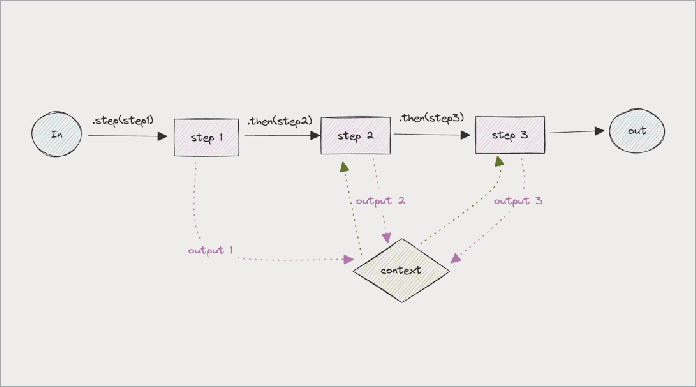
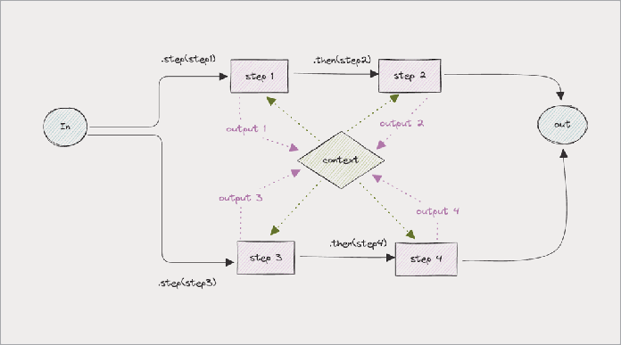
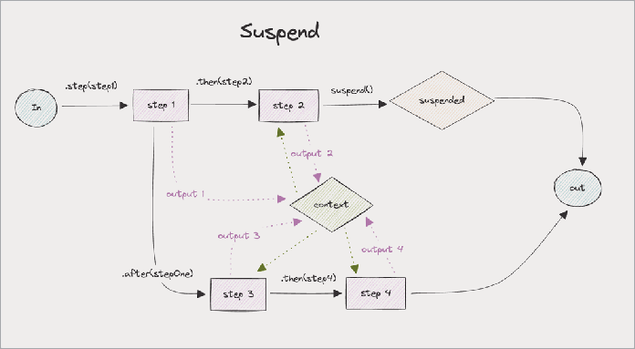
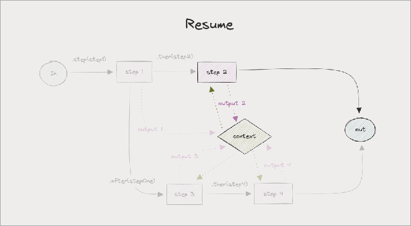
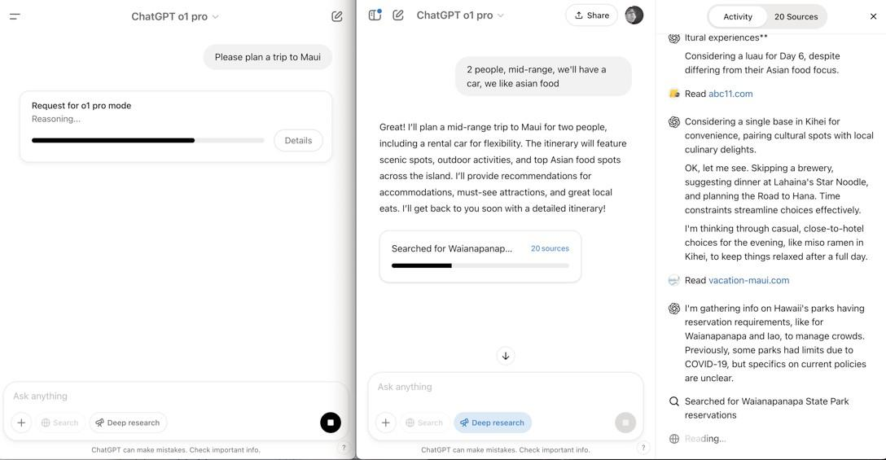
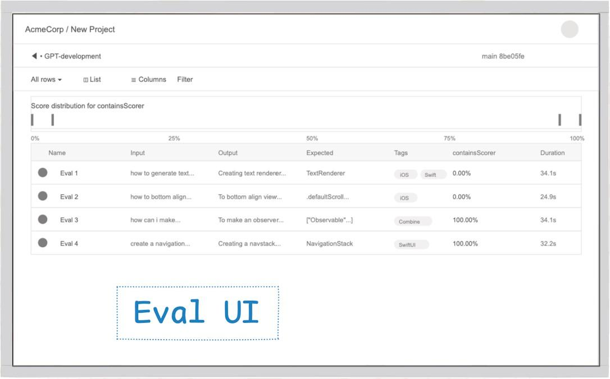

# Chaining

Ini adalah operasi paling sederhana. Terkadang, Anda ingin mengambil data dari sumber remote sebelum memberikannya ke LLM, atau memberikan hasil dari satu panggilan LLM ke LLM lain.

Di Mastra, Anda merantai dengan perintah `.then()`. Berikut contoh sederhana:



Setiap langkah dalam rantai menunggu langkah sebelumnya selesai, dan memiliki akses ke hasil langkah sebelumnya melalui konteks.

## Merging

Setelah jalur percabangan menyimpang untuk menangani aspek berbeda dari suatu tugas, mereka sering perlu bertemu lagi untuk menggabungkan hasilnya:



## Conditions

Terkadang workflow Anda perlu membuat keputusan berdasarkan hasil intermediate.

Dalam graph workflow, karena beberapa jalur biasanya dapat dieksekusi secara paralel, di Mastra kami mendefinisikan eksekusi jalur kondisional pada child step daripada parent step.

Dalam contoh ini, step processData dieksekusi, tergantung pada keberhasilan step fetchData.

```javascript
myWorkflow.step(
  new Step({
    id: "processData",
    execute: async ({ context }) => {
      // Action logic
    },
  }),
  {
    when: {
      "fetchData.status": "success",
    },
  }
)
```

## Best Practices and Notes

Berguna untuk menyusun langkah sedemikian rupa sehingga input/output di setiap langkah bermakna dalam beberapa hal, karena Anda akan dapat melihatnya di tracing Anda. (Lebih lanjut di bagian Tracing).

Lainnya adalah menguraikan langkah sedemikian rupa sehingga LLM hanya perlu melakukan satu hal pada satu waktu. Ini biasanya berarti tidak lebih dari satu panggilan LLM di langkah mana pun.

Banyak kasus khusus yang berbeda dari graph workflow, seperti loop, retry, dll dapat dibuat dengan menggabungkan primitif ini.

## SUSPEND AND RESUME

Terkadang workflow perlu menjeda eksekusi sambil menunggu pihak ketiga (seperti human-in-the-loop) memberikan input.

Karena pihak ketiga dapat memakan waktu lama untuk merespons, Anda tidak ingin menjaga proses tetap berjalan.

Sebagai gantinya, Anda ingin mempertahankan status workflow, dan memiliki beberapa fungsi yang dapat Anda panggil untuk melanjutkan dari tempat Anda berhenti.

Mari diagram contoh sederhana dengan Mastra, yang memiliki fungsi `.suspend()` dan `.resume()`:



Untuk menangani workflow yang ditangguhkan, Anda dapat memantau perubahan status dan melanjutkan eksekusi ketika siap:



Berikut contoh sederhana membuat workflow dengan suspend dan resume di Mastra.

Step adalah blok bangunan workflow.

Buat step menggunakan createStep:

```typescript
// Create a step with defined input/output schemas and execution logic
const inputSchema = z.object({
 inputValue: z.string(),
});

const myStep = createStep({
 id: "my-step",
 description: "Does something useful.",
 inputSchema,
 outputSchema: z.object({
   outputValue: z.string(),
 }),

 // Optional: Define the resume schema for step resumption
 resumeSchema: z.object({
   resumeValue: z.string(),
 }),

 // Optional: Define the suspend schema for step suspension
 suspendSchema: z.object({
   suspendValue: z.string(),
 }),

 execute: async ({
   inputData,
   Maestra,
   getStepResult,
   getInitData,
   runtimeContext,
 }) => {
   const otherStepOutput = getStepResult(step2);
   const initData = getInitData<typeof inputSchema>(); // typed as the input schema
                                                     // variable (zod schema)
   return {
     outputValue: `Processed: ${inputData.inputValue}, ${initData.startValue}`,
     {runtimeContextValue: `${runtimeContext.get("runtimeContextValue")}`},
   };
 },
});
```

Kemudian buat workflow menggunakan createWorkflow:

```typescript
// Create a workflow with defined steps and execution flow
const myWorkflow = createWorkflow({
  id: "my-workflow",
  // Define the expected input structure (should match the first step's inputSchema)
  inputSchema: z.object({
    startValue: z.string(),
  }),
  // Define the expected output structure (should match the last step's outputSchema)
  outputSchema: z.object({
    result: z.string(),
  }),
  steps: [step1, step2, step3], // Declare steps used in this workflow
})
  .then(step1)
  .then(step2)
  .then(step3)
  .commit()

// Register workflow with Maestra instance
const maestra = new Maestra({
  vnext_workflows: {
    myWorkflow,
  },
})

// Create a run instance of the workflow
const run = maestra.vnext_getWorkflow("myWorkflow").createRun()
```

Setelah mendefinisikan workflow, jalankan seperti ini:

```javascript
// Create a run instance
const run = myWorkflow.createRun()

// Start the workflow with input data
const result = await run.start({
  inputData: {
    startValue: "initial data",
  },
})

// Access the results
console.log(result.steps) // All step results
console.log(result.steps["step-id"].output) // Output from a specific step

if (result.status === "success") {
  console.log(result.result) // The final result of the workflow, result of the last
  // step (or .map()'s output, if used as last step)
} else if (result.status === "suspended") {
  const resumeResult = await run.resume({
    step: result.suspended[0], // there is always at least one step id in the suspended
    // array, in this case we resume the first suspended execution path
    resumeData: {
      /* user input */
    },
  })
} else if (result.status === "failed") {
  console.error(result.error) // only exists if status is failed, this is an instance of
  // Error
}
```

## STREAMING UPDATES

Salah satu kunci untuk membuat aplikasi LLM terasa cepat dan responsif adalah menunjukkan kepada pengguna apa yang terjadi sementara

model sedang bekerja. Kami telah mengirimkan beberapa peningkatan besar di sini, dan demo baru kami benar-benar menunjukkan apa yang dapat dilakukan streaming modern.

Mari kita tinjau kembali pencarian saya yang sedang berlangsung (dan masih belum berhasil) untuk merencanakan perjalanan ke Hawaii.

Tahun lalu, saya mencoba dua model reasoning berdampingan: o1 pro OpenAI (tab kiri) dan Deep Research (tab kanan).

o1 pro hanya menunjukkan kotak "reasoning" berputar selama tiga menit — tidak ada umpan balik, hanya menunggu. Deep Research, di sisi lain, segera meminta detail (jumlah orang, anggaran, kebutuhan diet), lalu streaming kembali pembaruan saat itu

menemukan restoran dan atraksi. Rasanya jauh lebih cepat dan membuat saya tetap terinformasi sepanjang waktu.



Kiri: o1 pro (kurang baik). Kanan: Deep Research (lebih baik)

### Bagaimana streaming dari dalam fungsi

Inilah tangkapannya: ketika Anda membangun agen LLM, Anda biasanya streaming di tengah fungsi yang mengharapkan tipe pengembalian tertentu. Terkadang, Anda harus menunggu seluruh output LLM sebelum fungsi dapat mengembalikan hasil ke pengguna. Tapi bagaimana jika fungsi membutuhkan waktu lama? Di sinilah segalanya menjadi rumit. Idealnya, Anda ingin streaming progres langkah demi langkah ke pengguna segera setelah Anda memilikinya, bukan hanya membuang semuanya di akhir.

Banyak orang meretas ini. Misalnya, Simon di Assistant UI menyiapkan aplikasinya untuk menulis setiap token dari OpenAI langsung ke database saat streaming masuk, menggunakan ElectricSQL untuk langsung menyinkronkan

pembaruan tersebut ke frontend. Ini menciptakan semacam "escape hatch" — bahkan jika fungsi belum selesai, pengguna melihat progres langsung.

### Mengapa streaming penting

Hal paling umum untuk di-stream adalah output LLM sendiri (menunjukkan token saat dihasilkan.) Tetapi Anda juga dapat streaming pembaruan dari setiap langkah dalam workflow atau pipeline agen multi-langkah, seperti ketika agen sedang mencari, merencanakan, dan meringkas secara berurutan.

Ini membuat pengguna tetap terlibat dan yakin bahwa segalanya bergerak, bahkan jika backend masih memproses.

### Cara Membangun Ini

- Stream sebanyak mungkin: Baik itu token, langkah workflow, atau data kustom, kirim ke pengguna secepatnya.
- Gunakan alat reaktif: Library seperti ElectricSQL atau framework seperti Turbo Streams memudahkan untuk menyinkronkan pembaruan backend langsung ke UI.
- Escape hatches: Jika fungsi Anda terjebak menunggu, temukan cara untuk mendorong hasil parsial atau pembaruan progres ke frontend.

Intinya: Streaming bukan hanya sekadar nice-to-have — itu penting untuk UX yang baik di aplikasi LLM. Pengguna ingin

melihat progres, bukan hanya layar kosong. Jika Anda berhasil dalam hal ini, agen Anda akan terasa lebih cepat dan lebih andal, bahkan jika backend masih bekerja keras.

Sekarang, jika hanya streaming bisa membantu saya benar-benar sampai ke Hawaii…

## OBSERVABILITY AND TRACING

Karena LLM non-deterministik, pertanyaannya bukan apakah aplikasi Anda akan keluar jalur.

Tapi kapan dan seberapa banyak.

Tim yang telah mengirimkan agen ke produksi biasanya berbicara tentang betapa pentingnya melihat data produksi untuk setiap langkah, dari setiap run, dari masing-masing workflow mereka.

Framework agen seperti Mastra yang memungkinkan Anda menulis kode sebagai graph workflow terstruktur juga akan memancarkan telemetri yang memungkinkan hal ini.

## Observability

Observability adalah kata yang banyak diperbincangkan, tetapi karena maknanya telah banyak diencerkan dan digeneralisasi oleh vendor yang berkepentingan sendiri, mari kita ke akarnya.

Istilah awal dipopulerkan oleh Honeycomb's Charity Majors di akhir 2010-an untuk menggambarkan kualitas dapat memvisualisasikan trace aplikasi.

## Tracing

Untuk mendebug fungsi, akan sangat bagus untuk dapat melihat input dan output dari setiap fungsi yang dipanggilnya. Dan input dan output dari setiap fungsi yang dipanggil oleh fungsi-fungsi tersebut. (Dan seterusnya, turun ke bawah.)

Telemetri semacam ini disebut trace, yang terdiri dari pohon span. (Pikirkan tentang dokumen HTML bersarang, atau flame chart.)

Format standar untuk trace dikenal sebagai OpenTelemetry, atau OTel untuk singkatnya. Ketika vendor monitoring mulai mendukung tracing, masing-masing memiliki spesifikasi berbeda — tidak ada portabilitas. Lightstep's Ben Sigelman membantu membuat standar Otel umum, dan vendor besar seperti Datadog (dengan paksa) mulai mendukung Otel.

Ada sejumlah besar vendor observability, baik yang lebih tua backend dan khusus AI, tetapi pola UI menyatu:


Layar tracing contoh

Apa yang diberikan oleh layar UI semacam ini adalah:

- Tampilan trace. Ini menunjukkan berapa lama setiap langkah dalam pipeline (misalnya, parse_input, process_request, api_call, dll.)
- Inspeksi input/output. Melihat "Input" dan "Output" tepat dalam JSON membantu untuk mendebug data yang mengalir masuk dan keluar dari Lams
- Metadata panggilan. Menampilkan status, waktu mulai/akhir, latensi, dll.) memberikan konteks kunci di sekitar setiap run, membantu manusia memindai anomali.

### Evals

Juga bagus untuk dapat melihat evaluasi Anda (lebih lanjut tentang evaluasi nanti) di lingkungan cloud.

Untuk setiap evaluasi mereka, orang ingin melihat perbandingan sisi-ke-sisi tentang bagaimana agen merespons versus yang diharapkan.

Mereka ingin melihat skor keseluruhan pada setiap PR (untuk memastikan tidak ada regresi), dan skor dari waktu ke waktu, dan memfilter berdasarkan tag, tanggal run, dan sebagainya.

UI evaluasi cenderung terlihat seperti ini:



Layar evaluasi contoh

### Catatan akhir tentang observability dan tracing

Anda akan membutuhkan alat cloud untuk melihat data semacam ini untuk aplikasi produksi Anda.

Juga bagus untuk dapat melihat data ini secara lokal ketika Anda sedang mengembangkan (Mastra melakukan ini). Lebih lanjut tentang ini di bagian pengembangan lokal.

Ada standar umum yang disebut OpenTelemetry, atau OTel untuk singkatnya, dan kami sangat merekomendasikan memancarkan dalam format itu.
