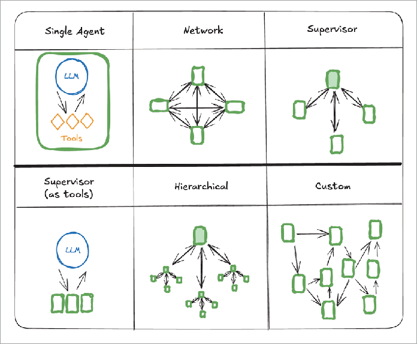

# BAGIAN V

RETRIEVAL-AUGMENTED GENERATION (RAG)

## RAG 101

RAG memungkinkan agen mengonsumsi data pengguna dan mensintesisnya dengan basis pengetahuan global mereka untuk memberikan respons berkualitas tinggi kepada pengguna.

Berikut cara kerjanya.

- Chunking: Anda mulai dengan mengambil dokumen (meskipun kita dapat menggunakan jenis sumber lain juga) dan melakukan chunking. Kami ingin membagi dokumen menjadi potongan kecil untuk pencarian.
- Embedding: Setelah chunking, Anda akan ingin meng-embed data Anda – mengubahnya menjadi vektor, atau array dari 1536 nilai antara 0 dan 1, yang mewakili makna teks.

Kami melakukan ini dengan LLM, karena mereka membuat embedding jauh lebih akurat; OpenAI memiliki API untuk ini, ada penyedia lain seperti Voyage atau Cohere.

Anda perlu menggunakan vektor DB yang dapat menyimpan

vektor-vektor ini dan melakukan perhitungan untuk mencari di dalamnya. Anda dapat menggunakan pgvector, yang tersedia langsung dengan Postgres.

- Indexing: Setelah Anda memilih vektor DB, Anda perlu mengatur indeks untuk menyimpan potongan dokumen Anda, direpresentasikan sebagai embedding vektor.
- Querying: Oke, setelah setup itu, Anda sekarang dapat meng-query database!

Di balik layar, Anda akan menjalankan algoritma yang membandingkan string query Anda dengan semua potongan di database dan mengembalikan yang paling mirip. Algoritma paling populer disebut "cosine similarity".

Implementasinya mirip dengan query geospasial yang mencari lintang/bujur, kecuali pencarian dilakukan di 1536 dimensi daripada dua.

Anda juga dapat menggunakan algoritma lain.

- Reranking: Opsional, setelah query, Anda dapat menggunakan reranker. Reranking adalah cara yang lebih intensif secara komputasi untuk mencari dataset. Anda dapat menjalankannya pada hasil Anda untuk meningkatkan pengurutan (tetapi akan terlalu lama untuk menjalankannya di seluruh database).
- Synthesis: akhirnya, Anda meneruskan hasil Anda sebagai konteks ke LLM, bersama dengan konteks lain yang Anda inginkan, dan itu dapat mensintesis jawaban untuk pengguna.

## MEMILIH VEKTOR DATABASE

Salah satu pertanyaan terbesar yang dimiliki orang tentang RAG adalah bagaimana mereka harus memikirkan vektor DB.

Ada beberapa bentuk vektor database:

1. Fitur di atas database open-source (pgvector di atas Postgres, libsql vector store)
2. Standalone open-source (Chroma)
3. Standalone hosted cloud service (Pinecone).
4. Hosted oleh penyedia cloud yang ada (Cloudflare Vectorize, DataStax Astra).

Pandangan kami adalah bahwa kecuali kasus penggunaan Anda sangat

spesialis, fitur set vektor DB sebagian besar sudah terkomoditisasi.

Kembali pada 2023, pendanaan VC mendorong ledakan besar dalam perusahaan vektor DB, yang sementara menarik untuk ruang secara keseluruhan, menciptakan seperangkat solusi bersaing dengan sedikit diferensiasi.

Hari ini, dalam praktiknya tim melaporkan bahwa hal terpenting adalah mencegah sprawl infra (layanan lain lagi untuk dipelihara). Rekomendasi kami:

Jika Anda sudah menggunakan Postgres untuk backend aplikasi Anda, pgvector adalah pilihan yang bagus. Jika Anda memulai proyek baru,

Pinecone adalah pilihan default dengan UI yang bagus.

Jika penyedia cloud Anda memiliki layanan vektor DB terkelola, gunakan itu.

## MENYIAPKAN PIPELINE RAG ANDA

### Chunking

Chunking adalah proses memecah dokumen besar menjadi bagian-bagian kecil yang dapat dikelola untuk diproses.

Hal kunci yang perlu Anda pilih di sini adalah strategi dan jendela overlap. Chunking yang baik menyeimbangkan pelestarian konteks dengan granularitas pengambilan.

Strategi chunking termasuk pemisahan rekursif, berbasis karakter, sadar token, dan khusus format (Markdown, HTML, JSON, LaTeX). Mastra mendukung semuanya.

### Embedding

Embedding adalah representasi numerik dari teks yang menangkap makna semantik. Vektor ini memungkinkan kita melakukan pencarian kesamaan. Mastra mendukung beberapa penyedia embedding seperti OpenAI dan Cohere, dengan kemampuan menghasilkan embedding untuk potongan individu dan array teks.

### Upsert

Operasi upsert memungkinkan Anda menyisipkan atau memperbarui vektor dan metadata yang terkait di penyimpanan vektor Anda. Operasi ini penting untuk mempertahankan basis pengetahuan Anda, menggabungkan vektor embedding dan metadata tambahan apa pun yang mungkin berguna untuk pengambilan.

### Indexing

Indeks adalah struktur data yang mengoptimalkan pencarian kesamaan vektor. Saat membuat indeks, Anda menentukan parameter seperti ukuran dimensi (sesuai dengan model embedding Anda) dan metrik kesamaan (cosine, euclidean, dot product). Ini adalah langkah setup satu kali untuk setiap kumpulan vektor.

## Querying

Querying melibatkan konversi input pengguna menjadi embedding dan menemukan vektor serupa di penyimpanan vektor Anda. Query dasar mengembalikan potongan yang paling mirip secara semantik dengan input Anda, biasanya dengan skor kesamaan. Di balik layar, ini adalah sekumpulan perkalian matriks untuk menemukan titik terdekat di ruang *n-*dimensi (pikirkan tentang pencarian geo dengan lat/lng, kecuali dalam 1536 dimensi).

Algoritma paling umum yang melakukan ini disebut cosine similarity (meskipun Anda dapat menggunakan yang lain).

Hybrid Queries with Metadata. Query hibrida menggabungkan pencarian kesamaan vektor dengan filter metadata tradisional. Ini memungkinkan Anda mempersempit hasil berdasarkan kesamaan semantik dan bidang metadata terstruktur seperti tanggal, kategori, atau atribut kustom.

## Reranking

Reranking adalah langkah pasca-pemrosesan yang meningkatkan relevansi hasil dengan menerapkan metode penilaian yang lebih canggih. Ini mempertimbangkan faktor seperti relevansi semantik,

kesamaan vektor, dan bias posisi untuk mengurutkan ulang hasil untuk akurasi yang lebih baik.

Ini adalah proses yang lebih intens secara komputasi, jadi Anda biasanya tidak ingin menjalankannya di seluruh korpus karena alasan latensi — Anda biasanya hanya menjalankannya pada contoh kode.

## Contoh Kode

Berikut beberapa kode menggunakan Mastra untuk menyiapkan pipeline RAG. Mastra menyertakan antarmuka yang konsisten untuk membuat indeks, upsert embedding, dan query, sambil menawarkan fitur dan optimasi unik mereka sendiri, jadi sementara contoh ini menggunakan Pinecone, Anda dapat dengan mudah menggunakan DB lain.

```typescript
import { Mastra } from "@mastra/core";
import { MDocument, PgVector } from "@mastra/rag";
import { embedMany, embed } from "@ai";
import { openai } from "@oai-sdk/openai";

// Initialize document and create chunks
const doc = MDocument.fromText('Your text content here...');
const chunks = await doc.chunk({
 strategy: "recursive",
 size: 512,
 overlap: 50,
});

// Generate embeddings
const { embeddings } = await embedMany({
 values: chunks.map(chunk => chunk.text),
 model: openai.embedding("text-embedding-3-small"),
});

// Initialize vector store and Mastra
const pgVector = new PgVector({ process.env.POSTGRES_CONNECTION_STRING! });
const mastra = new Mastra({ vectors: { pgVector } });

// Store embeddings
await pgVector.createIndex("embeddings", 1536);
await pgVector.upsert({
 "embeddings",
 embeddings,
 chunks.map(chunk => ({ text: chunk.text }))
});

// Query example
const query = "insert query here";
const { embedding } = await embed({
 value: query,
 model: openai.embedding("text-embedding-3-small"),
});

// Retrieve similar chunks
const results = await pgVector.query("embeddings", embedding);
const relevantContext = results
 .map(result => result?.metadata?.text)
 .join('\n\n');

// Generate response
const completion = await openai("gpt-4o-mini").generate({
 Please answer the following question:
 ${query}

 Based on this context: ${relevantContext}
 If the context lacks sufficient information, please state that
 explicitly.
});

console.log(completion.text);
```

### Catatan: Ada cara lanjutan untuk melakukan RAG: menggunakan LLM untuk menghasilkan metadata, menggunakan LLM untuk menyempurnakan query pencarian; menggunakan

graph database untuk memodelkan hubungan kompleks. Ini mungkin berguna untuk Anda, tetapi mulai dengan menyiapkan pipeline yang berfungsi dan menyesuaikan parameter normal — model embedding, reranker, algoritma chunking — terlebih dahulu.

# BAGIAN VI

SISTEM MULTI-AGEN

## MULTI-AGEN 101

Pikirkan tentang sistem multi-agen seperti tim khusus, seperti pemasaran atau teknik, di perusahaan. Agen AI yang berbeda

bekerja bersama, masing-masing dengan peran khusus mereka sendiri, untuk akhirnya menyelesaikan tugas yang lebih kompleks.

Menariknya, jika Anda pernah menggunakan alat pembuatan kode seperti agen Replit yang diterapkan di produksi, Anda sebenarnya sudah menggunakan sistem multi-agen.

Satu agen bekerja dengan Anda untuk merencanakan / mengarsitektur kode Anda. Setelah Anda bekerja dengan agen untuk merencanakannya, Anda bekerja dengan agen "manajer kode" yang meneruskan instruksi ke penulis kode, lalu mengeksekusi kode yang dihasilkan di sandbox dan meneruskan kesalahan apa pun kembali ke penulis kode.

Masing-masing agen ini memiliki memori yang berbeda,

system prompt yang berbeda, dan akses ke alat yang berbeda.

Kami sering bercanda bahwa mendesain sistem multi-agen melibatkan banyak keterampilan yang digunakan dalam desain organisasi. Anda mencoba mengelompokkan tugas terkait ke dalam deskripsi pekerjaan di mana Anda dapat merekrut seseorang. Anda mungkin memberikan tugas kreatif atau generatif kepada satu orang dan tugas tinjauan atau analitis kepada orang lain. Anda ingin memikirkan dinamika jaringan. Apakah lebih baik bagi tiga agen khusus untuk bergosip di antara mereka sendiri sampai konsensus tercapai? Atau memberi umpan balik output mereka ke agen manajer yang dapat membuat

keputusan?



Satu keuntungan dari sistem multi-agen adalah

memecah tugas kompleks menjadi bagian-bagian yang dapat dikelola. Dan tentu saja, desainnya fraktal. Hierarki hanyalah supervisor dari supervisor. Tetapi mulai dengan versi paling sederhana terlebih dahulu.

Mari kita uraikan beberapa pola.

AGEN SUPERVISOR

Agen supervisor adalah agen khusus yang mengoordinasi dan mengelola agen lain. Cara paling langsung untuk melakukan ini adalah dengan meneruskan agen lain yang dibungkus sebagai alat.

Misalnya, dalam sistem pembuatan konten, agen penerbit mungkin mengawasi penulis naskah dan editor:

```javascript
const publisherAgent = new Agent({
  name: "publisherAgent",
  instructions: "You are a publisher agent that coordinates content creation. First call the copywriter for initial content, then the editor for refinement.",
  model: {
    provider: "ANTHROPIC",
    name: "claude-3-5-sonnet-20241022",
  },
  tools: { copywriterTool, editorTool },
})
```

# CONTROL FLOW

Saat membangun aplikasi AI kompleks, Anda memerlukan cara terstruktur untuk mengelola bagaimana agen berpikir dan bekerja melalui tugas. Sama seperti manajer proyek tidak akan mulai coding tanpa rencana, agen harus menetapkan pendekatan sebelum terjun ke eksekusi.

Sama seperti bagaimana praktik umum bagi PM untuk membuat spesifikasi fitur, mendapatkan persetujuan pemangku kepentingan, dan hanya kemudian menugaskan pekerjaan teknik, Anda tidak boleh berharap untuk bekerja dengan agen tanpa terlebih dahulu menyelaraskan pekerjaan yang diinginkan.

Kami merekomendasikan melibatkan agen Anda pada detail arsitektur terlebih dahulu — dan mungkin menambahkan beberapa checkpoint untuk umpan balik manusia dalam workflow mereka.

# WORKFLOWS AS TOOLS

Semoga, pada titik ini, Anda mulai melihat bahwa semua arsitektur multi-agen bermuara pada primitif mana yang Anda gunakan dan bagaimana Anda mengaturnya.

Sangat penting untuk mengingat framing ini saat mencoba membangun tugas yang lebih kompleks ke dalam agen.

Katakanlah Anda ingin agen Anda menyelesaikan 3 tugas terpisah. Anda tidak dapat melakukan ini dengan mudah dalam satu panggilan LLM. Tetapi Anda dapat mengubah masing-masing tugas tersebut menjadi workflow individual. Ada lebih banyak kepastian dalam melakukan ini karena Anda dapat menetapkan urutan langkah workflow dan memberikan lebih banyak struktur.

Masing-masing workflow ini kemudian dapat diteruskan sebagai alat ke agen.

## COMBINING THE PATTERNS

Jika Anda telah bermain-main dengan alat penulisan kode seperti Repl.it dan Lovable.dev, Anda akan melihat bahwa mereka memiliki agen perencanaan dan agen penulisan kode. (Dan sebenarnya agen penulisan kode adalah dua agen berbeda, peninjau dan penulis yang bekerja sama.)

Sangat penting bagi alat-alat ini untuk memiliki agen perencanaan jika mereka ingin membuat deliverable yang baik untuk Anda sama sekali.

Agen perencanaan mengusulkan arsitektur untuk aplikasi yang Anda inginkan. Itu bertanya kepada Anda, "bagaimana kedengarannya?"

Anda dapat memberikan umpan balik sampai Anda dan agen cukup selaras pada rencana sehingga dapat meneruskannya ke agen penulisan kode.

Dalam contoh ini, agen mewujudkan langkah berbeda dalam

workflow. Mereka bertanggung jawab baik untuk perencanaan, pengkodean, atau tinjauan dan masing-masing bekerja dalam urutan tertentu.

Dalam contoh sebelumnya, Anda akan melihat bahwa workflow adalah langkah (alat) untuk agen. Ini adalah contoh terbalik satu sama lain, yang membawa kita, sekali lagi, pada kesimpulan penting.

Semua primitif dapat disusun ulang dengan cara yang Anda inginkan, khusus untuk alur kontrol yang Anda inginkan.

## MULTI-AGENT STANDARDS

Meskipun tidak menikmati peluncuran cepat seperti MCP Anthropic, protokol lain yang mendapatkan kecepatan di musim semi 2025 adalah A2A Google.

Sementara semua materi multi-agen yang telah kita bahas sejauh ini berkaitan dengan bagaimana Anda akan mengoordinasikan banyak agen dengan asumsi Anda mengendalikan semuanya, A2A adalah protokol untuk berkomunikasi dengan agen "tidak terpercaya".

Seperti MCP, A2A memecahkan masalah n x n. Jika ada n agen berbeda, yang masing-masing menggunakan framework berbeda, Anda harus menulis n x m integrasi berbeda untuk membuat mereka bekerja sama.

### Bagaimana A2A bekerja

A2A mengandalkan file metadata JSON yang di-host di

`/.well-known/agent.json` yang menjelaskan apa yang dapat dilakukan agen, URL endpoint-nya, dan persyaratan autentikasi.

Setelah otorisasi terjadi, dan dengan asumsi agen telah mengimplementasikan protokol klien dan server A2A, mereka dapat mengirim tugas satu sama lain dengan sistem antrian.

Tugas memiliki ID unik dan berkembang melalui status seperti submitted, working, input-required, completed, failed, atau canceled. A2A mendukung pola permintaan-respons sinkron dan streaming untuk tugas yang berjalan lama menggunakan Server-Sent Events.

Komunikasi terjadi melalui HTTP dan JSON-RPC 2.0, dengan pesan berisi bagian (teks, file, atau data terstruktur). Agen dapat menghasilkan artefak sebagai output dan mengirim pembaruan waktu nyata via server-side events. Komunikasi menggunakan auth web standar — OAuth, kunci API, kode HTTP, dan sebagainya.

### A2A vs. MCP

A2A lebih muda dari MCP, dan sementara Microsoft mendukung A2A, baik OpenAI maupun Anthropic belum bergabung. Mungkin mereka melihat MCP sebagai kompetitif dengan A2A. Waktu yang akan membuktikan.

Bagaimanapun, harapkan satu atau beberapa protokol interoperabilitas agen dari pemain besar muncul sebagai standar default.

Principles of Building AI Agents 99

# BAGIAN VII

EVALUASI

## EVALUASI 101

Sementara tes software tradisional memiliki kondisi lulus/gagal yang jelas, output AI non-deterministik — mereka dapat bervariasi dengan input yang sama. Evaluasi membantu menjembatani kesenjangan ini dengan menyediakan metrik yang dapat diukur untuk mengukur kualitas agen.

Alih-alih hasil lulus/gagal biner, evaluasi mengembalikan skor antara 0 dan 1.

Pikirkan evaluasi seperti memasukkan, misalnya, pengujian kinerja dalam pipeline CI Anda. Akan ada beberapa keacakan dalam setiap hasil, tetapi secara keseluruhan dan dari waktu ke waktu harus ada korelasi antara kinerja aplikasi dan hasil tes.

Saat menulis evaluasi, penting untuk memikirkan apa sebenarnya yang ingin Anda uji.

Ada berbagai jenis evaluasi seperti ada berbagai jenis tes.

Tes unit mudah ditulis dan dijalankan tetapi mungkin tidak menangkap perilaku yang penting; tes end-to-end mungkin menangkap perilaku yang benar tetapi mereka mungkin lebih fluktuatif.

Demikian pula, jika Anda membangun pipeline RAG, atau workflow terstruktur, Anda mungkin ingin menguji setiap langkah sepanjang jalan, dan setelah itu menguji perilaku sistem secara keseluruhan.

# EVALUASI TEKS

Evaluasi teks bisa terasa sedikit seperti asisten mahasiswa pascasarjana yang menilai pekerjaan rumah Anda dengan rubrik. Mereka akan sedikit terlalu teliti, tetapi mereka biasanya memiliki poin.

### Akurasi dan keandalan

Anda dapat mengevaluasi seberapa benar, jujur, dan lengkap jawaban agen Anda. Misalnya:

- Hallucination. Apakah respons mengandung fakta atau klaim yang tidak ada dalam konteks yang diberikan? Ini sangat penting untuk aplikasi RAG.
- Faithfulness. Apakah respons secara akurat mewakili konteks yang diberikan?
- Content similarity. Apakah respons mempertahankan informasi yang konsisten di berbagai frasa?
- Completeness. Apakah respons mencakup semua informasi yang diperlukan dari input atau konteks?
- Answer relevancy. Seberapa baik respons menangani query asli?

### Memahami konteks

Anda dapat mengevaluasi seberapa baik agen Anda menggunakan konteks yang diberikan, misalnya kutipan yang diambil dari sumber, fakta dan statistik, dan detail pengguna yang ditambahkan ke konteks. Misalnya:

- Context position. Di mana konteks muncul dalam respons? (Biasanya posisi yang benar untuk konteks adalah di atas.)
- Context precision. Apakah potongan konteks dikelompokkan secara logis? Apakah respons mempertahankan makna asli?
- Context relevancy. Apakah respons menggunakan potongan konteks yang paling tepat?
- Contextual recall. Apakah respons sepenuhnya "mengingat" konteks yang diberikan?

### Output

Anda dapat mengevaluasi seberapa baik model menyampaikan jawaban akhirnya sesuai dengan persyaratan seputar format, gaya, kejelasan, dan keselarasan.

- Tone consistency. Apakah respons mempertahankan tingkat formalitas, kompleksitas teknis, nada emosional, dan gaya yang benar?
- Prompt Alignment. Apakah respons mengikuti instruksi eksplisit seperti batasan panjang, elemen yang diperlukan, dan persyaratan format spesifik?
- Summarization Quality. Apakah respons mengondensasi informasi secara akurat? Pertimbangkan misalnya retensi informasi, akurasi faktual, dan keringkasan?
- Keyword Coverage. Apakah respons mencakup istilah teknis dan penggunaan terminologi?

Metrik evaluasi output lainnya seperti deteksi toksisitas & bias penting tetapi sebagian besar sudah dimasukkan ke dalam model terkemuka.

### Contoh Kode

Berikut contoh dengan tiga metrik evaluasi berbeda yang secara otomatis memeriksa output agen penulisan konten untuk akurasi, kesetiaan terhadap materi sumber, dan potensi halusinasi:

```typescript
import { Agent } from "@mastra/core/agent"
import { openai } from "@ai-sdk/openai"

import { FaithfulnessMetric, ContentSimilarityMetric, HallucinationMetric } from "@mastra/evals/nlp"

// Configure the agent with the evals array
export const myAgent = new Agent({
  name: "ContentWriter",
  instructions: "You are a content writer that creates accurate",
  model: openai("gpt-4o"),
  evals: [
    new FaithfulnessMetric(), // Checks if output matches source material
    new ContentSimilarityMetric({
      threshold: 0.8, // Require 80% similarity with expected output
    }),
    new HallucinationMetric(),
  ],
})
```

# EVALUASI LAINNYA

Ada beberapa jenis evaluasi lainnya juga.

## Evaluasi Klasifikasi atau Pelabelan

Evaluasi klasifikasi atau pelabelan membantu menentukan seberapa akurat model menandai atau mengategorikan data berdasarkan kategori yang telah ditentukan (misalnya, sentimen, topik, spam vs. bukan spam).

Ini dapat mencakup tugas pelabelan luas (seperti mengenali maksud dokumen) atau tugas halus (seperti mengidentifikasi entitas spesifik alias ekstraksi entitas).

## Evaluasi Penggunaan Alat Agen

Evaluasi penggunaan alat atau agen mengukur seberapa efektif model atau agen memanggil alat atau API eksternal untuk memecahkan masalah.

Misalnya, seperti Anda akan menulis `expect(Fn).toBeCalled` dalam framework pengujian JavaScript Jest, Anda akan menginginkan fungsi serupa untuk penggunaan alat agen.

### Evaluasi Rekayasa Prompt

Evaluasi rekayasa prompt mengeksplorasi bagaimana instruksi, format, atau frasa query pengguna yang berbeda berdampak pada kinerja agen.

Mereka melihat sensitivitas agen terhadap variasi prompt (apakah perubahan kecil menghasilkan perbedaan besar dalam hasil) dan ketangguhan terhadap input adversarial atau ambigu.

Semua hal "prompt injection" termasuk dalam kategori ini.

### A/B testing

Setelah Anda meluncurkan, tergantung pada lalu lintas Anda, sangat masuk akal untuk menjalankan eksperimen langsung dengan pengguna nyata untuk membandingkan dua versi sistem Anda.

Bahkan, pemimpin perusahaan AI alat konsumen dan pengembang yang lebih besar, seperti Perplexity dan Replit, bercanda bahwa mereka lebih mengandalkan pengujian A/B metrik pengguna daripada evaluasi per se. Mereka memiliki cukup lalu lintas sehingga degradasi kualitas agen akan terlihat dengan cepat.

## Tinjauan data manusia

Selain tes otomatis, tim AI berkinerja tinggi secara teratur meninjau data produksi. Biasanya, cara termudah untuk melakukan ini adalah dengan melihat trace yang menangkap input dan output setiap langkah dalam pipeline. Kami membahas ini sebelumnya di bagian workflow dan deployment.

Banyak aspek kebenaran (misalnya, pengetahuan domain yang halus, atau permintaan pengguna yang tidak biasa) tidak dapat sepenuhnya ditangkap oleh asersi kaku, tetapi mata manusia menangkap nuansa ini.
