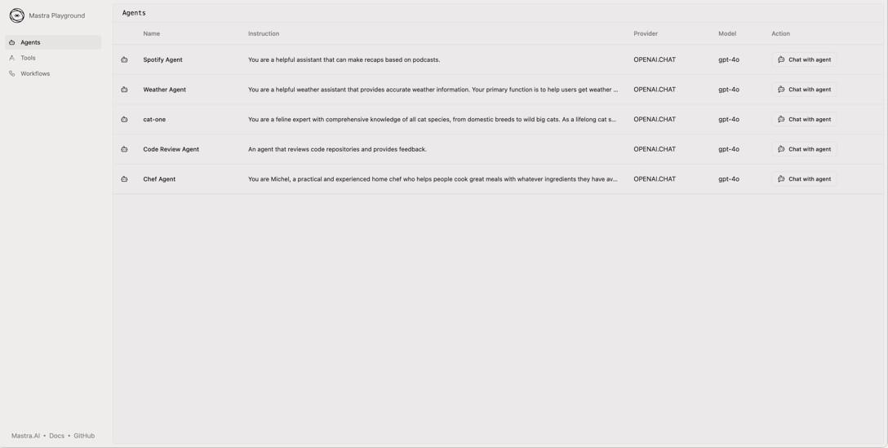

# BAGIAN VIII

PENGEMBANGAN & DEPLOYMENT

## PENGEMBANGAN LOKAL

Pengembangan agen biasanya jatuh ke dalam dua kategori berbeda: membangun frontend dan backend.

### Membangun frontend web agentik

Frontend agen berbasis web cenderung berbagi beberapa karakteristik: mereka dibangun di sekitar antarmuka chat, streaming ke backend, autoscroll, menampilkan panggilan alat.

Kami membahas pentingnya streaming di bab sebelumnya. Antarmuka agentik cenderung menggunakan berbagai opsi transportasi berbeda seperti request/response, server-sent events, webhook dan web socket, semua untuk memberi rasa interaktivitas real-time.

Ada beberapa framework yang kami lihat mempercepat pengembangan di sini, terutama selama fase prototipe: Assistant UI, Copilot Kit, dan Vercel's AI SDK UI.

(Dan banyak agen berbasis platform lain seperti WhatsApp, Slack, atau email dan tidak memiliki frontend web!)

Penting untuk dicatat bahwa sementara frontend agentik bisa kuat, logika agen penuh umumnya tidak dapat hidup di sisi klien di browser untuk alasan keamanan — itu akan membocorkan kunci API Anda ke penyedia LLM.

### Membangun backend agen

Jadi di backend-lah kami biasanya melihat sebagian besar kompleksitas.

Saat mengembangkan aplikasi AI, penting untuk melihat apa yang dilakukan agen Anda, memastikan alat Anda bekerja, dan dapat dengan cepat beriterasi pada prompt Anda.

Beberapa hal yang kami lihat membantu untuk pengembangan agen lokal:

- Agent Chat Interface: Uji percakapan dengan agen Anda di browser, melihat bagaimana mereka merespons input berbeda dan menggunakan alat yang dikonfigurasi.
- Workflow Visualizer: Melihat eksekusi workflow langkah demi langkah dan dapat menangguhkan/melanjutkan/memutar ulang
- Agent/workflow endpoints: Dapat melakukan curl ke agen dan workflow di localhost (ini juga memungkinkan penggunaan misalnya Postman)
- Tool Playground: Menguji alat apa pun dan dapat memverifikasi input / output tanpa perlu memanggilnya melalui agen.
- Tracing & Evals: Melihat input dan output setiap langkah eksekusi agen dan workflow, serta metrik evaluasi saat Anda beriterasi pada kode.

Berikut tangkapan layar dari lingkungan pengembangan lokal Mastra:



## DEPLOYMENT

Pada Mei 2025, kami masih umumnya berada di era Heroku dari deployment agen.

Kebanyakan tim menempatkan agen mereka ke

semacam server web, lalu menempatkan server itu ke gambar Docker dan mendeploynya ke platform yang akan menskalakannya.

Sementara aplikasi web cukup dipahami sehingga kami dapat membuat kemajuan pada paradigma deployment serverless (Vercel, Render, AWS Lambda, dll), agen belum mencapai titik itu.

### Tantangan deployment

Relatif terhadap siklus request/response web tipikal, workload agen agak lebih rumit.

Mereka sering berjalan lama, mirip dengan workload pada mesin eksekusi tahan lama seperti

Temporal dan Inngest. Tetapi mereka masih terikat pada permintaan pengguna spesifik.

Dijalankan di platform serverless, proses berjalan lama dapat menyebabkan timeout fungsi. Selain itu, ukuran bundle bisa terlalu besar, dan beberapa host serverless tidak mendukung runtime Node.js penuh.

### Menggunakan platform terkelola

Tim agen yang tidur paling nyenyak di malam hari adalah yang kami lihat yang menemukan cara menjalankan agen mereka menggunakan layanan terkelola auto-scaling.

Penyedia serverless (umumnya) belum sampai — proses berjalan lama dapat menyebabkan timeout fungsi, dan ukuran bundle adalah masalah.

Tim yang menggunakan layanan kontainer seperti AWS EC2, Digital Ocean, atau setara tampaknya baik-baik saja selama mereka memiliki kasus penggunaan B2B yang tidak akan memiliki lonjakan penggunaan tiba-tiba.

(Dan tentu saja, di Mastra, kami memiliki layanan cloud beta dengan autoscaling)

# BAGIAN IX

SEGALA SESUATU LAINNYA

## MULTIMODAL

Salah satu cara untuk memikirkan multimodalitas (gambar, video, suara) dalam AI adalah dengan memetakan tanggal asal mereka di berbagai platform.

Pertimbangkan Internet: itu mendukung teks dari asalnya pada 1970-an, tetapi gambar dan video tidak didukung sampai browser web (1992), dan suara tidak sampai 1995.

Suara dan video tidak menjadi populer sampai YouTube (2002) dan Skype (2003), dengan bandwidth dan kecepatan koneksi yang lebih besar.

Atau pikirkan tentang jejaring sosial: semua yang awal, seperti MySpace (2002), Facebook (2004), dan Twitter (2008), terutama berbasis teks.

Media sosial berbasis gambar tidak menjadi populer sampai Instagram (2010) dan Snapchat (2013), dan media sosial berbasis video sampai TikTok (2017).

Dalam AI, maka, tidak heran bahwa kasus penggunaan multimodal sedikit lebih muda dan kurang matang. Seperti di platform sebelumnya, mereka lebih rumit untuk dilakukan dengan benar, dan lebih kompleks secara komputasi.

### Pembuatan Gambar

Maret 2025 membawa penemuan Ghibli-core — pikirkan warna lembut, latar belakang mimpi, dan karakter bermata lebar ikonik itu.

Orang telah bermain dengan Midjourney, Stable Diffusion, dan lainnya untuk sementara waktu. Tetapi Maret adalah langkah maju dalam pembuatan gambar tingkat konsumen, dengan mentranspos foto ke gaya tertentu.

Orang mengunggah selfie atau foto lama, menambahkan prompt, dan langsung mendapatkan versi anime yang terlihat langsung dari "Spirited Away."


Para pendiri Mastra (Shane, Abhi dan Sam) di pertandingan basket

Ini bukan hanya hal khusus; tren Ghibli mengambil alih feed sosial di mana-mana. Akun (Trump) White House resmi bergabung dengan keributan dengan (kontroversial) men-tweet gambar imigran yang ditahan yang di-Ghibli-kan.

Secara lebih luas, momen "Ghibli" menunjukkan vitalitas untuk kasus penggunaan seni digital — pembuatan gambar untuk sesuatu yang berada di antara storyboard, sketsa karakter, dan konsep lingkungan.

### Kasus Penggunaan

Dalam hal orang menggunakan pembuatan gambar untuk produk, ada beberapa kasus penggunaan.

Dalam pemasaran dan e-commerce, mockup produk

pada latar belakang beragam dan generasi kreatif iklan cepat tanpa pemotretan dan dalam berbagai faktor bentuk. Model gambar "Try-on" memungkinkan orang menukar model manusia tetapi menjaga item pakaian yang ditampilkan.

Kasus penggunaan ketiga untuk pembuatan gambar telah dalam produksi video game dan film. Pembuatan gambar memungkinkan untuk prototyping aset, termasuk potret, tekstur, properti, serta perencanaan tata letak adegan melalui alur "sketsa ke render" kasar.

Dinyatakan dalam istilah pengembangan web, ini memberikan fidelity desain penuh dengan usaha/keterampilan wireframe.

Terakhir, ada kasus penggunaan lebih NSFW. Ini cenderung tidak dapat didanai ventura, tetapi setidaknya menurut desas-desus Silicon Valley, cukup banyak kasus penggunaan yang lebih risqu´e mencetak uang — jika Anda dapat menemukan prosesor pembayaran yang akan menerima bisnis Anda.

### Suara

Modaliitas kunci dalam suara adalah speech-to-text (STT), text-to-speech (TTS), dan speech-to-speech, juga dikenal sebagai suara real-time.

Apa yang diinginkan pengguna dalam produk suara agen adalah sesuatu yang dapat memahami nada mereka, dan merespons segera.

Untuk melakukan itu, Anda dapat melatih model yang

secara khusus mengambil token suara sebagai input, dan merespons dengan token suara sebagai output. Itu dikenal sebagai "suara real-time", tetapi itu terbukti menantang.

Pertama, sulit untuk melatih model seperti itu; kepadatan informasi audio hanya 1/1000 dari teks, jadi model ini membutuhkan data input yang jauh lebih banyak untuk dilatih dan berbiaya lebih tinggi untuk dilayani.

Kedua, model ini masih kesulitan dengan pergantian bicara, dikenal dalam industri sebagai "voice activity detection". Saat berbicara, manusia terus-menerus saling menyela menggunakan isyarat visual dan emosional.

Tetapi model suara tidak memiliki isyarat ini, dan harus berurusan dengan latensi komputasi dan jaringan. Ketika mereka menyela terlalu awal, mereka memotong orang; ketika mereka menyela terlalu terlambat, mereka terdengar robotik.

Sementara produk ini membuat demo yang bagus, tidak terlalu banyak perusahaan yang menggunakan suara real-time dalam produksi.

Apa yang mereka gunakan sebagai gantinya adalah pipeline speech-to-text (STT) dan text-to-speech (TTS). Mereka menggunakan satu model untuk menerjemahkan input suara ke teks, model lain untuk menghasilkan respons teks, lalu menerjemahkan respons teks ke respons audio.

Berikut contoh mendengarkan; Anda dapat mengikuti ini dengan `agent.speak()` untuk membalas.

```javascript
import { Agent } from "@mastra/core/agent";
import { OpenAIVoice } from "@mastra/voice-openai";

const agent = new Agent({
 name: 'Agent',
 instructions: `You are a helpful assistant with
voice capabilities.`,
 model: openai('gpt-4o'),
 voice: new OpenAIVoice();
});

const audioStream =
 fs.createReadStream('/path/to.mp3')

const text = await agent.listen(audioStream)

// Hey! How are ya!
```

## Video

Produk pembuatan video AI, sementara menarik, belum melintas dari machine learning ke rekayasa AI.

Model konsumen belum memiliki momen Studio Ghibli mereka di mana mereka dapat secara akurat mewakili karakter dalam input dan memutarnya kembali dalam pengaturan alternatif.

Akibatnya, produk cenderung membutuhkan banyak pengetahuan khusus untuk dibangun, dan mengonsumsi siklus GPU pada runtime menghasilkan avatar dari input pengguna yang kemudian dapat diputar kembali dalam pengaturan dan skenario baru.

# PEMBUATAN KODE

Dengan lepas landasnya perusahaan seperti bolt.new dan Lovable, serta rilis agen pengkodean dalam rentang seminggu dari OpenAI, Microsoft, dan Google, telah muncul gelombang orang yang tertarik membangun agen pengkodean mereka sendiri.

Memberikan alat pembuatan kode kepada agen Anda membuka workflow yang kuat, tetapi juga datang dengan pertimbangan keamanan dan kualitas penting.

Jadi, pertimbangkan hal berikut:

- Feedback Loops: Agen dapat menulis kode, menjalankannya, dan menganalisis hasilnya. Misalnya, jika kode melempar error, agen dapat membaca pesan error dan mencoba lagi — memungkinkan perbaikan iteratif.
- Sandboxing: Selalu jalankan kode yang dihasilkan di lingkungan sandbox. Ini mencegah agen secara tidak sengaja (atau jahat) menjalankan perintah berbahaya di mesin Anda (seperti `rm -rf /`).
- Code Analysis: Anda dapat memberi agen akses ke linter, static type checker, dan alat analisis lainnya. Ini memberikan umpan balik ground truth dan membantu agen menulis kode berkualitas lebih tinggi.

Jika Anda membangun agen kode, Anda harus melihat lebih dalam alat dan platform yang mengkhususkan diri khusus dalam kasus penggunaan ini.

# APA BERIKUTNYA

Ruang agen bergerak sangat cepat.
Kami tidak memiliki bola kristal, tetapi dari sudut pandang kami sebagai framework agen terkemuka, inilah yang kami lihat:

- Model reasoning akan terus membaik. Agen seperti Windsurf dan Cursor dapat mencolokkan Claude 3.7, o4-mini-high, dan Claude 4, dan meningkatkan kinerja secara signifikan. Tapi seperti apa agen yang dibangun untuk model reasoning? Kami tidak yakin.
- Kami akan membuat kemajuan pada pembelajaran agen. Agen memancarkan trace, tetapi saat ini umpan balik untuk meningkatkan kinerja mereka berjalan melalui pemrogram manusia mereka. Tim berbeda sedang mengerjakan pendekatan berbeda untuk pembelajaran agen (misalnya supervised fine-tuning sebagai layanan). Tetapi masih belum jelas apa pendekatan yang tepat.
- Evaluasi sintetis. Saat ini, menulis evaluasi adalah proses intensif yang digerakkan manusia. Beberapa produk menghasilkan evaluasi secara sintetis dari data tracing, dengan persetujuan manusia, untuk kasus penggunaan khusus. Kami berharap itu akan berkembang selama beberapa bulan ke depan.
- Keamanan akan menjadi lebih penting. Saat saya menulis kata-kata ini, saya membaca tentang kerentanan di server MCP Github resmi yang akan membocorkan repo pribadi, kredensial API, dan sebagainya. Jumlah agen yang diterapkan mungkin akan 10x atau 100x selama beberapa bulan ke depan, dan kami akan melihat lebih banyak insiden seperti ini.
- September abadi AI akan berlanjut. Setiap bulan membawa pengembang baru yang belum belajar cara menulis prompt yang baik atau apa itu vektor database. Sementara itu, kecepatan cepat pembaruan model berarti bahkan tim mapan terus-menerus menyesuaikan implementasi mereka. Di bidang di mana tanah terus bergeser, kita semua adalah pemula abadi. Untuk membangun sesuatu yang bertahan, Anda harus tetap rendah hati.
